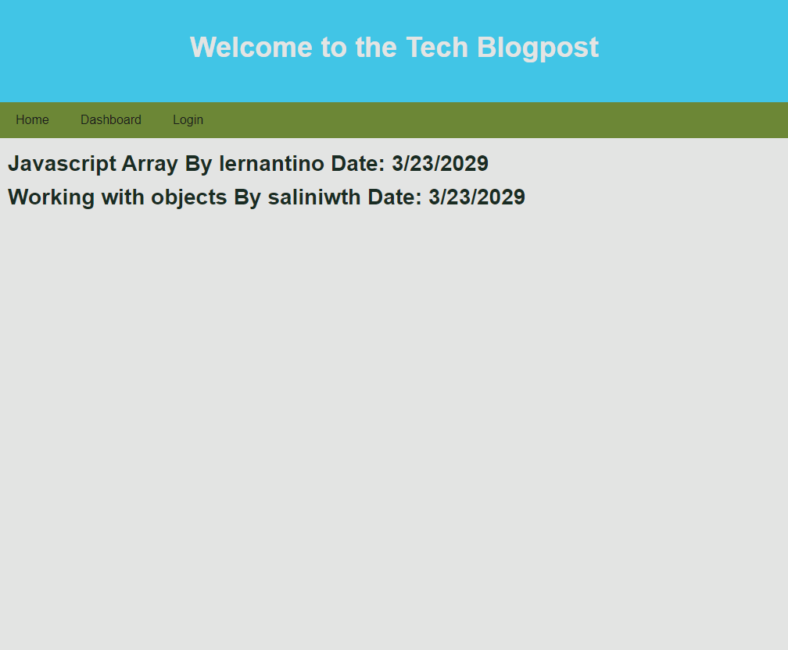

# MVC Tech Blog

## Description

This Project is made to immitate an online blogpost web application. By using MVC with Mysql, we are able to setup an application where users can create their own accounts to login to the site where they will all be tuned into a general blog post application. This project mainly focuses on routing between handlebar pages as well as authentication for logins to make sure that accounts are created with secruity and users are able to share their comments with one another.

## Repository
https://github.com/evan17812/MVC-Tech-Blog

## Screenshot
